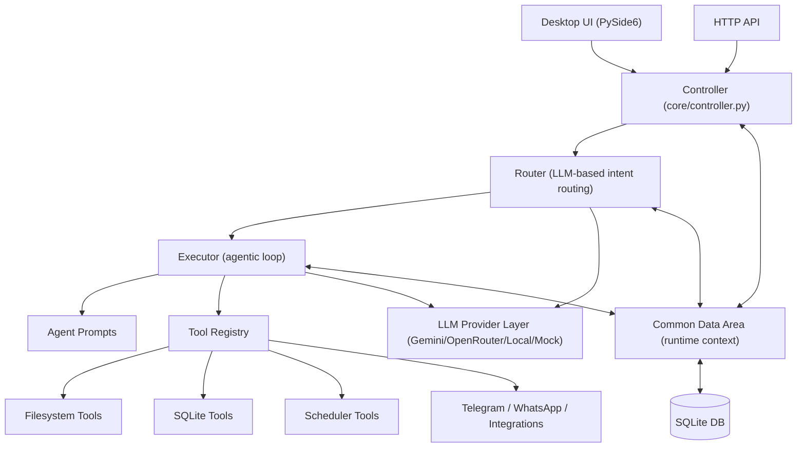

# Oasis-DAS

**Oasis-DAS (Oasis Desktop Agentic System)** is a modular AI orchestration platform that starts as a local desktop assistant and scales into a hostable multi-channel automation system.

It combines:
- A desktop chat interface for human-in-the-loop control
- A router + executor agentic runtime for task planning and execution
- A tool ecosystem (filesystem, SQLite, scheduling, integrations)
- An HTTP API for web/hosted clients
- Extendable prompts and role-based agents for real business workflows

---

## Why Oasis-DAS

Oasis-DAS is designed for teams that want practical AI operations, not only chat responses.

It helps you:
- Run AI workflows on local machines with full context
- Convert repeated operations into tool-backed automations
- Keep deterministic control through explicit routing and execution loops
- Move from local desktop usage to hostable deployment without rewriting core logic

---

## Core Architecture



### Architecture Layers

1. **Interface Layer**
- Desktop UI for local operations and observability.
- HTTP API for browser/hosted clients.

2. **Orchestration Layer (`core/`)**
- `controller.py`: Coordinates request lifecycle.
- `router.py`: Selects best-fit agent for each task.
- `executor.py`: Runs iterative tool-augmented completion loop.
- `conversation_manager.py`: Manages continuity and session behavior.

3. **Agent Layer (`agents/`)**
- Domain agents (file manager, schedule manager, database manager, attendance manager, etc.).
- Prompt-driven behavior with structured templates.

4. **Tools Layer (`tools/`)**
- Operational capabilities as controlled function calls.
- Files, database, scheduler, and channel integrations.

5. **Model Layer (`llm/`)**
- Provider abstraction to switch between local and cloud LLMs.
- Mock mode for testing and stable development workflows.

6. **State and Persistence**
- SQLite-backed metadata and runtime records.
- Settings and prompt templates for configurable behavior.

---

## Product Roadmap

### 1) Desktop Version (Current + Near-Term)

**Goal:** Best-in-class local AI operations cockpit.

Planned/active capabilities:
- Rich chat UI with session history and context continuity
- Local tool execution with strict validation and logging
- Agent marketplace pattern (add/edit/activate specialized agents)
- Strong reliability: retries, guardrails, and deterministic fallbacks
- Improved onboarding: one-click setup and diagnostics

Success criteria:
- Fast local-first assistant with stable tool execution
- Clear observability for every request, tool call, and output path

### 2) Hostable Version (Mid-Term)

**Goal:** Run Oasis-DAS as a service for teams and products.

Planned capabilities:
- Multi-user, role-aware hosted runtime
- Authenticated API access for external apps
- Team workspaces with controlled agent/tool permissions
- Deployable profiles (single-node, container, managed cloud)
- Centralized logs, health checks, and runtime analytics

Success criteria:
- Secure and scalable hosted orchestration
- Backward-compatible behavior with desktop workflows

### 3) Auto Pages (Mid-to-Long Term)

**Goal:** Turn outputs into publishable knowledge and operational pages automatically.

Planned capabilities:
- Auto-generate markdown/web pages from conversations and tool outputs
- Scheduled page refresh for reports, summaries, and status dashboards
- Template-based publishing for GitHub Pages/internal portals
- Source-linked evidence blocks and versioned page snapshots
- Approval workflow before publishing to production docs

Success criteria:
- Zero-copy flow from AI execution to shareable documentation
- Reliable, repeatable publishing pipeline for operational knowledge

---

## Use Cases

### Operations Automation
- Scheduled data extraction + report generation
- File organization, compliance checks, and audit prep
- Internal runbook execution with traceable outputs

### Engineering Productivity
- Project-aware coding/task assistants
- Local log triage and incident investigation support
- Multi-step script orchestration with human approval

### Team Knowledge Systems
- Convert decisions/chats into structured docs
- Build living SOP pages from repeat workflows
- Maintain searchable operational memory

### Messaging and Support Channels
- Route tasks from Telegram/WhatsApp to domain agents
- Generate structured responses with context retention
- Escalate unresolved cases with full action history

---

## Quick Start

```bash
python -m venv .venv
# Windows
.\.venv\Scripts\Activate.ps1
# macOS/Linux
source .venv/bin/activate
pip install -r requirements.txt
python main.py
```

Start API gateway:

```bash
python api_start.py
```

---

## Project Vision

Oasis-DAS aims to become a **local-to-hostable agentic operating layer** for businesses:
- Start private and local
- Scale to team-hosted orchestration
- Publish outcomes automatically as actionable pages

---

## Hashtags

#OasisDAS #DesktopAgenticSystem #AgenticAI #AIAutomation #LocalFirstAI #MultiAgentSystems #LLMOrchestration #AIEngineering #WorkflowAutomation #AIOps #DeveloperTools #ProductivityEngineering #PythonAI #SQLite #PySide6 #HostableAI #AutoPages #KnowledgeAutomation #GitHubProjects
