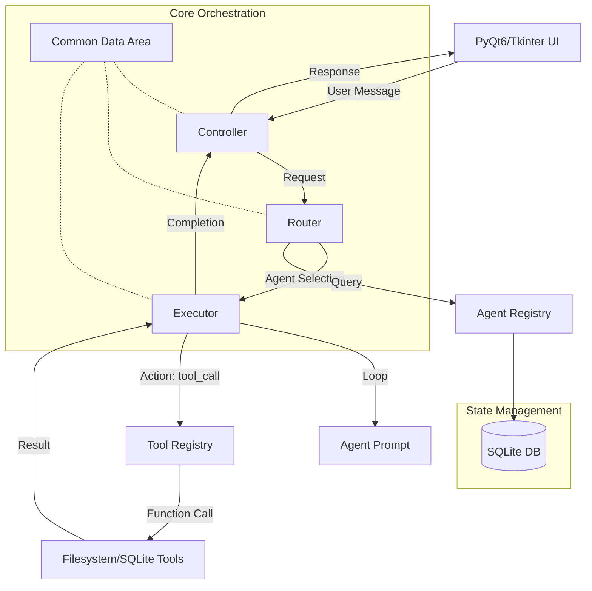

# Project Architecture Overview: OAS-AI

The OAS-AI is a modular agentic system designed for desktop automation. It follows a layered architecture that separates the UI, orchestration, agentic logic, and tool execution.

## System Architecture Diagram

## Core Components

### 1. Orchestration Layer (`core/`)
- **Controller**: The central hub. It receives input from the UI and coordinates with the Router and Executor. It manages the high-level flow of each user interaction.
- **Router**: The decision-maker. It uses an LLM to analyze the user's request and select the most appropriate agent (e.g., `file_manager`, `database_manager`) from the list of active agents.
- **Executor**: The worker. It manages the "agentic loop." It repeatedly calls the LLM with the agent's instructions, executes any tools requested by the LLM, and feeds the results back until the task is complete.
- **Common Data Area (CDA)**: A singleton state manager. It stores session data, memory (chat history, tool outputs), and application settings, providing a consistent context for all components.

### 2. Agent Layer (`agents/`)
- **Agent Registry**: Manages the lifecycle of agents. It stores agent descriptions and prompts in a SQLite database, allowing for dynamic addition and modification of agent behaviors.
- **Agent Prompts**: Template files that define the instructions, constraints, and tool usage guidelines for specific domains.

### 3. Tool Layer (`tools/`)
- A collection of Python functions encapsulated as "tools."
- **Tool Registry**: A central dispatcher that maps tool names to their corresponding functions.
- **Available Tools**: Includes filesystem operations (read/write/list) and database management (SQL execution).

### 4. LLM Layer (`llm/`)
- Provides a unified interface for interacting with LLM providers.
- Supports **Gemini** (for production) and a **Mock Client** (for local development and testing).

### 5. UI Layer (`ui/`)
- A desktop interface (PyQt6 in Phase 2) that handles user interaction and provides real-time feedback from agents.

## Data Persistence
- **SQLite Database**: Stores agent configurations, user roles, and business-specific data (e.g., attendance records, expense reports).
- **Settings**: Managed via `defaults.json` and `user_config.json`, loaded into the CDA at startup.

## Execution Flow
1. **Input**: User sends a message via the UI.
2. **Routing**: The Controller asks the Router which agent should handle it.
3. **Execution**: The Controller delegates to the Executor.
4. **Looping**: The Executor runs a loop:
    - Renders the Agent's prompt with current context.
    - Asks LLM for next action.
    - If `tool_call`: Executes tool, updates context, and repeats.
    - If `complete`: Returns final response.
5. **Output**: The Controller sends the response back to the UI.
