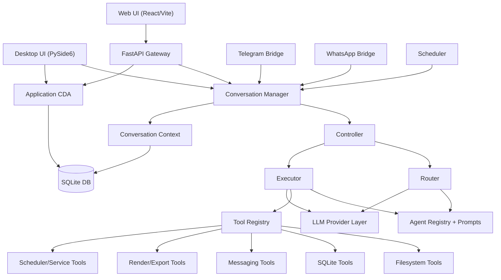
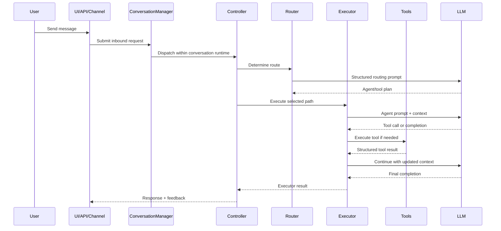
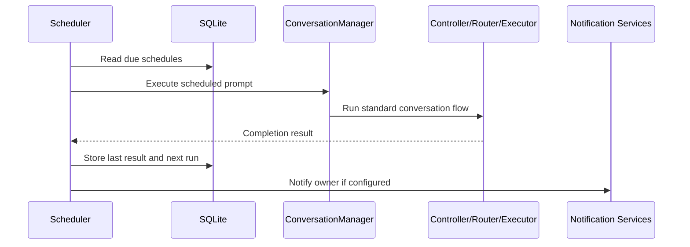

# Oasis-DAS Architecture and Design Concept

## 1. Executive Summary

Oasis-DAS, short for **Oasis Desktop Agentic System**, is designed as a **local-first AI orchestration platform** that can evolve into a hosted multi-user automation system without replacing its core execution model.

The codebase implements that idea by separating the system into a small number of stable layers:

- **Experience layer** for desktop, browser, API, and channel-based interaction
- **Orchestration layer** for request intake, routing, execution, and conversation isolation
- **Agent layer** for prompt-defined domain behaviors
- **Tool layer** for deterministic side effects such as filesystem, database, scheduler, and messaging operations
- **Model layer** for provider-agnostic LLM access
- **Persistence layer** for settings, metadata, users, tools, schedules, history, and operational state

The architecture is not a pure research-style multi-agent framework. It is closer to an **operations-oriented agent runtime**: conversational input is converted into routed work, work is executed through controlled tools, and all major interfaces share the same runtime spine.

## 2. Product Design Concept

The central design concept is:

> **Use conversational AI as the control surface, but keep execution explicit, tool-backed, and operationally inspectable.**

This leads to five major design goals.

### 2.1 Local-first execution

The desktop application is the primary runtime. It keeps state, tools, and data close to the user machine so the system can access local files, local databases, and local integrations with minimal friction.

### 2.2 Shared core, multiple shells

Desktop UI, web UI, API clients, scheduler jobs, Telegram, and WhatsApp are treated as different entry points into the same orchestration engine rather than separate applications with separate logic.

### 2.3 Prompt-defined specialization

Specialized behavior is represented by named agents with dedicated prompt files and optional tool assignments. This allows the platform to express business workflows as configurable AI roles instead of hardcoding one monolithic assistant.

### 2.4 Deterministic tool execution

The LLM is used to decide and compose actions, but actual side effects are pushed through registered Python tools. That keeps execution auditable and makes the system more controllable than free-form text generation alone.

### 2.5 Path to hosted deployment

The runtime design already anticipates API exposure, authentication, session isolation, background scheduling, and channel integration. That makes the desktop product a foundation for a later service-oriented deployment model.

## 3. High-Level Architecture

## 4. Runtime Topology

The repository has a deliberate split between **shared core runtime** and **delivery surfaces**.

### 4.1 Core runtime

The main orchestration logic lives under `apps/das_core`. This contains:

- `core/` for request flow and conversation runtime
- `agents/` for prompt-defined agents and registry logic
- `tools/` for callable capabilities
- `llm/` for provider implementations
- `settings/` and `prompts/` for configurable behavior
- `ui/` for the desktop shell

### 4.2 API and hosted edge

`apps/api_gateway` wraps the same core runtime with:

- FastAPI endpoints
- session-based auth and admin flows
- settings and service management APIs
- HTTP chat access
- operational endpoints for agents, roles, tools, users, logs, scheduler, and integrations

### 4.3 Frontend surfaces

- `apps/ui_desktop` and `apps/das_core/ui` provide the desktop interface
- `apps/ui_web` provides the browser-based operational console

### 4.4 Channel adapters

The system includes support for:

- Telegram channel services
- WhatsApp folder bridge
- WhatsApp headless bridge

These are not independent agent stacks. They are transport adapters that feed work into the same conversation engine.

## 5. Core Architectural Building Blocks

## 5.1 Common Data Area and Context Model

The state model has two layers.

### Application-wide state

`CommonDataArea` is the shared application container. It stores:

- settings
- memory
- runtime objects
- session data

Conceptually, it works as the **runtime service locator and shared memory root**.

### Conversation-local state

`ConversationManager` creates isolated runtimes per conversation. Each runtime gets its own context, controller, router, executor, and LLM client. This is important because the platform needs both:

- a global app runtime for settings and long-lived services
- isolated per-conversation state for chat history, tool traces, cancellation, and token accounting

This hybrid model is one of the most important design choices in the system. It preserves a simple desktop-centric architecture while still enabling concurrent multi-session execution.

## 5.2 Bootstrap and Service Assembly

Application startup is handled by `app_bootstrap.py`.

At startup, the system:

1. creates the Common Data Area
2. loads settings into it
3. synchronizes tool metadata into SQLite
4. registers custom agents from configuration
5. builds the active LLM client
6. creates the `ConversationManager`
7. optionally starts Telegram, WhatsApp, and scheduler services

This means the runtime is assembled as a **composed operational environment**, not just a GUI app.

## 5.3 Controller

The `Controller` is the top-level orchestration coordinator for a single interaction.

Its responsibilities include:

- session awareness
- user identity and role resolution
- coordination between routing and execution
- response packaging
- operational logging
- continuity support for retries and follow-up interactions

The controller is the boundary where user-facing conversation logic meets the underlying execution pipeline.

## 5.4 Router

The `Router` decides what should happen next.

Its role is broader than simple agent selection. It can:

- inspect active agents
- inspect available tools
- include attachment context
- resolve user identity and role data
- normalize routing for file-ingestion flows
- validate LLM-produced routing output

In design terms, the router acts as the **intent-to-work planner**. It converts a request into structured downstream tasks such as:

- hand off to a domain agent
- call a tool directly
- continue with existing context

## 5.5 Executor

The `Executor` runs the selected agent workflow.

Its execution model is a classic controlled agent loop:

1. load the selected agent prompt
2. inject conversation and runtime context
3. call the LLM
4. validate the structured output
5. execute tools if requested
6. write tool outputs back into context
7. repeat until completion or failure

Important built-in behaviors include:

- token usage accounting
- permission hooks
- agent activity tracing
- placeholder replacement for prompt templates
- tool result capture for generated files
- per-agent tool filtering

The design intent is to keep the LLM responsible for reasoning, while the executor remains responsible for **state progression and control flow**.

## 6. Agent System Design

Agents are a major extension mechanism in Oasis-DAS.

### 6.1 Prompt-defined roles

Each agent is defined primarily by prompt content. Current examples include:

- task manager
- file manager
- schedule manager
- database manager
- project manager
- employee and attendance managers
- RAG-related agents
- organization management

### 6.2 Registry-backed metadata

The registry persists agent information and version history in SQLite, which supports:

- activation/deactivation
- versioned prompt restoration
- tool assignment
- role-to-agent mapping

### 6.3 Why this matters

This design allows the platform to behave like a configurable business operations system rather than a single static assistant. New domain capabilities can be added through prompts and tool policy instead of requiring deep orchestration rewrites.

## 7. Tool System Design

The tool layer is the deterministic execution boundary of the system.

### 7.1 Discovery and registration

`tool_registry.py` loads tool modules, registers exported callables, and publishes metadata into the `ToolList` table.

### 7.2 Tool categories

The active tool set spans several operational domains:

- filesystem tools such as read, list, inspect, copy, and move
- SQLite tools
- scheduler tools
- messaging tools for Telegram and WhatsApp
- render and export utilities
- agent-creation helpers
- file ingestion and embedding-related tooling

### 7.3 Architectural role

The tool registry gives the system a clean separation between:

- **AI planning**
- **trusted side-effect execution**

That separation is what makes the platform suitable for automation. The LLM proposes actions in structured form; the runtime executes known code.

## 8. LLM Provider Abstraction

The model layer is intentionally provider-agnostic.

The factory currently supports:

- Gemini
- Groq
- local model runtime
- OpenRouter
- mock client

This abstraction has two design benefits:

- operational flexibility across cost, latency, privacy, and accuracy constraints
- testability through mock execution paths

The router and executor both consume the same provider interface, which means model changes do not require orchestration redesign.

## 9. Interface and Access Layer

## 9.1 Desktop application

The desktop entry point creates a PySide6 application, applies branding assets, bootstraps the core runtime, and launches the chat UI. It also owns shutdown cleanup for background services.

This is the system's **primary local operator console**.

## 9.2 Web UI

The React web application functions as a broader operational dashboard, not only a chat surface. It includes:

- chat
- history
- sessions
- logs
- settings
- profile
- agent, role, user, tool, and scheduler management
- service and integration controls

This reflects the product concept: the platform is meant to be an **AI operations workspace**, not only a message window.

## 9.3 API gateway

The API layer exposes the runtime over FastAPI with:

- auth and admin APIs
- settings APIs
- operational control APIs
- HTTP chat
- bootstrap admin support

Architecturally, the API gateway is the first clear step from local desktop app to hostable service.

## 9.4 Messaging channels

Telegram and WhatsApp integrations allow work to originate outside the primary UI while still being processed by the same orchestration pipeline. This is a strong sign that the design is channel-agnostic at the runtime level.

## 10. Scheduling and Background Automation

The `SchedulerService` turns the conversational runtime into an automation runtime.

It:

- polls enabled schedule records
- computes next run times
- dispatches scheduled prompts through `ConversationManager`
- records results
- can notify owners through channel integrations

This is a critical design bridge between:

- interactive assistant behavior
- repeatable operations automation

In other words, Oasis-DAS is not only reactive. It can also operate on a timed background loop.

## 11. Persistence Model

SQLite is the system's operational persistence layer.

The database stores or supports:

- users and roles
- agent metadata and prompt versions
- tool metadata
- schedules
- chat history and logs
- service-related settings and operational records

SQLite is a pragmatic fit for the current architecture because the platform is primarily local-first, file-based, and operational rather than high-scale distributed.

## 12. End-to-End Request Lifecycle

### 12.1 Interactive request

### 12.2 Scheduled request

## 13. Architectural Strengths

The current design has several strong properties.

### 13.1 Clear execution spine

Controller, router, and executor form a clean orchestration chain that is easy to understand and extend.

### 13.2 Shared runtime across interfaces

Desktop, API, scheduler, and channels all reuse the same core behavior, which reduces duplication and preserves feature parity.

### 13.3 Practical extension points

Agents, tools, settings, and LLM providers are all modular and independently replaceable.

### 13.4 Strong fit for operations use cases

The combination of chat, tool execution, scheduling, logging, and service control is well aligned with internal automation and operations support.

## 14. Current Tradeoffs and Design Tensions

The architecture is effective, but it also shows some intentional tradeoffs.

### 14.1 Shared singleton plus isolated runtimes

The system uses both a singleton-style Common Data Area and per-conversation contexts. This is pragmatic, but it requires discipline to avoid leaking assumptions between global and local state.

### 14.2 Database-centered metadata management

Using SQLite for agents, tools, users, schedules, and history is simple and productive locally, but a future hosted deployment may eventually want stronger separation between configuration, identity, and event data.

### 14.3 Prompt-driven flexibility versus policy enforcement

Prompt-defined agents are easy to evolve, but they also make correctness depend on strong validation, tool restrictions, and schema discipline. The existing validator modules are important safeguards.

### 14.4 Multi-surface operational scope

The product already spans desktop UX, API runtime, channel adapters, scheduler automation, and admin operations. That breadth is powerful, but it also increases cohesion pressure on the core runtime.

## 15. Recommended Mental Model

The best way to understand Oasis-DAS is:

- not as a chatbot
- not as a pure workflow engine
- not as a generic multi-agent lab

Instead, it is best understood as a **local-first AI operations platform** with a **shared orchestration core** and **prompt-specialized workers** that act through deterministic tools.

That framing explains nearly every major design choice in the repository:

- desktop-first packaging
- API exposure
- per-conversation execution isolation
- database-backed agent and tool registries
- scheduler support
- external channel bridges
- provider-agnostic LLM layer

## 16. Strategic Evolution Path

The architecture already suggests a practical growth path.

### Phase 1: Strong local desktop operator

Continue refining:

- reliability
- observability
- prompt/tool governance
- local service management

### Phase 2: Hosted team runtime

Expand:

- authenticated multi-user tenancy
- stronger role-aware authorization
- deployment packaging
- centralized monitoring

### Phase 3: Publishable automation outcomes

Build on existing execution and export capabilities to support:

- auto-generated pages and reports
- evidence-backed knowledge artifacts
- approval workflows
- repeatable publishing pipelines

## 17. Conclusion

Oasis-DAS is architected around a strong and coherent core idea: **make AI operational by combining conversational control, explicit routing, prompt-specialized agents, deterministic tools, and reusable runtime services**.

Its design is pragmatic rather than academic. The platform favors:

- modularity over monolith prompts
- controlled execution over unconstrained generation
- operational reuse over interface-specific logic
- local practicality today with a path to hosted scale tomorrow

That makes the system well suited for evolving from a desktop assistant into a broader orchestration platform for business workflows, internal operations, and automation-heavy knowledge work.
