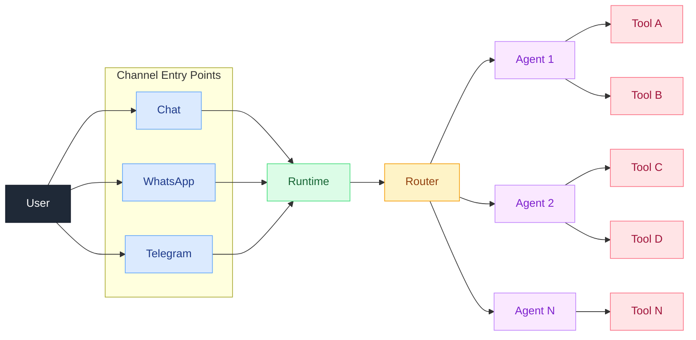
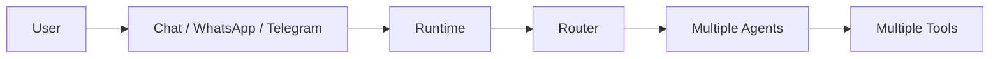

# Request Flow Diagram

This diagram focuses on the runtime request path you described:

- `User`
- `Chat / WhatsApp / Telegram`
- `Runtime`
- `Router`
- `Multiple Agents`
- `Multiple Tools`

## Compact Version

