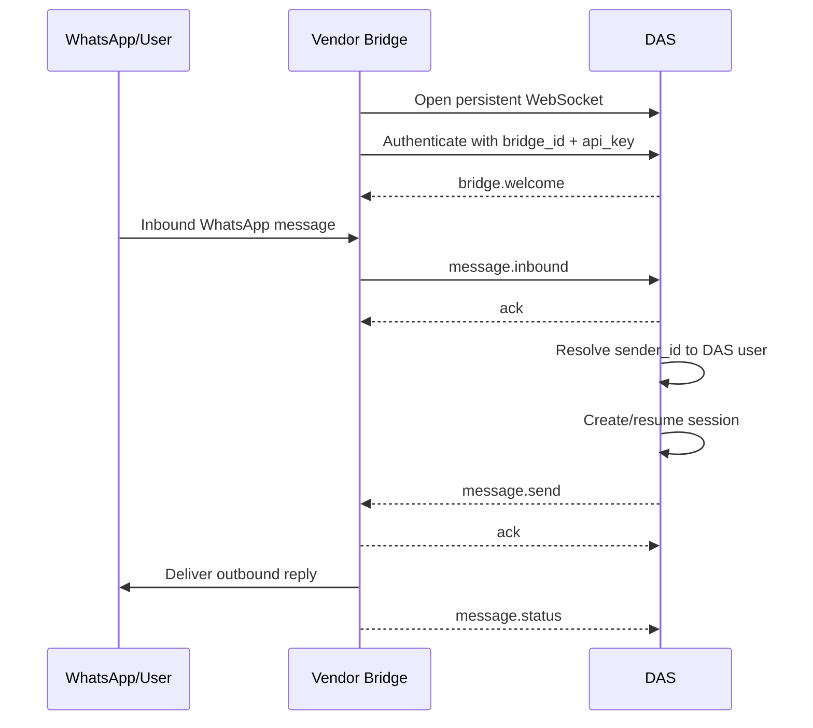

# DAS WhatsApp Bridge WebSocket Protocol Specification

Version: 1.0-draft
Date: 2026-03-15
Status: Proposed

## 1. Purpose

This document defines the future protocol between:

- DAS (Desktop Agentic System)
- An external WhatsApp Bridge service developed by a vendor

The bridge is responsible for talking to WhatsApp or to a WhatsApp provider API.
DAS is responsible for:

- authenticating the bridge
- mapping WhatsApp senders to DAS users
- creating and resuming DAS chat sessions
- generating outbound replies
- sending outbound messages back to the bridge for delivery

This protocol is transport-level and vendor-facing. It is intentionally independent of any specific WhatsApp provider implementation.

## 2. Goals

The protocol MUST support:

- a persistent bridge-to-DAS WebSocket connection
- bridge authentication using a DAS-generated API key
- inbound WhatsApp messages from the bridge into DAS
- outbound DAS messages from DAS back to the bridge
- sender-to-user mapping inside DAS
- duplicate inbound message protection
- delivery acknowledgements and failure reporting
- reconnect and heartbeat behavior

## 3. Non-Goals

Version 1 does not require:

- direct browser access
- user authentication through the bridge
- arbitrary media upload protocols
- group chat support
- template management for provider-specific outbound message templates

Media attachment support may be added later as a protocol extension.

## 4. High-Level Architecture



## 5. Terminology

- Bridge: External always-on service that connects to DAS and exchanges WhatsApp messages.
- Sender ID: The normalized WhatsApp user identifier, represented in this protocol as a phone number in E.164 format.
- DAS User: An internal user record in DAS.
- Channel Mapping: Mapping between `provider + sender_id` and internal `user_id`.
- Session: A DAS conversation session bound to a user and channel.

## 6. Transport

### 6.1 Endpoint

The bridge MUST connect to a DAS WebSocket endpoint.

Recommended endpoint:

`wss://<das-host>/ws/bridge/whatsapp/v1`

Notes:

- `wss://` MUST be used in production.
- `ws://` MAY be used only for local development on a trusted machine.

### 6.2 Connection Direction

The bridge MUST initiate and maintain the WebSocket connection to DAS.

Reason:

- DAS may need to send outbound messages at any time.
- A persistent bridge connection allows DAS to push outbound commands immediately.

### 6.3 Single Active Connection

Each `bridge_id` SHOULD have only one active connection.

If a second connection is established using the same `bridge_id`, DAS SHOULD:

- accept the newest connection
- close the previous connection
- log the replacement event

## 7. Authentication

### 7.1 Credential Model

DAS will expose a future WhatsApp settings tab where an administrator can create bridge credentials.

Each bridge credential MUST contain:

- `bridge_id`
- `provider` = `whatsapp`
- `api_key`
- `is_active`
- `created_at`
- `last_used_at`
- `last_remote_addr`

DAS MUST store only a hash of the API key, not the raw key.
The raw API key MUST be shown once to the administrator and then entered into the bridge configuration.

### 7.2 Handshake Headers

The bridge MUST authenticate during the WebSocket handshake using headers.

Required headers:

- `X-DAS-Bridge-Id: <bridge_id>`
- `Authorization: Bearer <api_key>`

Because the bridge is not a browser client, it can and should send custom headers.

### 7.3 DAS Validation Rules

On connection, DAS MUST validate:

- bridge exists
- bridge is active
- provider is `whatsapp`
- API key hash matches

If validation fails, DAS MUST reject the connection.

### 7.4 Optional Hardening

The following are RECOMMENDED but optional in version 1:

- TLS
- IP allowlisting
- API key rotation
- audit logging for bridge connection attempts

## 8. Message Encoding

All application messages exchanged over the socket MUST be UTF-8 encoded JSON objects.

Every message MUST use this envelope:

```json
{
  "protocol": "das.whatsapp.bridge/1.0",
  "type": "message.inbound",
  "message_id": "5f165e6c-4302-48bd-9a9f-6ac1e7a654f9",
  "reply_to": null,
  "timestamp": "2026-03-15T12:30:00Z",
  "payload": {}
}
```

Field rules:

- `protocol`: MUST be `das.whatsapp.bridge/1.0`
- `type`: message type
- `message_id`: sender-generated unique identifier for this protocol frame
- `reply_to`: the `message_id` being acknowledged or answered, else `null`
- `timestamp`: ISO-8601 UTC timestamp
- `payload`: type-specific body

## 9. Message Types

### 9.1 DAS to Bridge: `bridge.welcome`

Sent by DAS immediately after successful authentication.

Example:

```json
{
  "protocol": "das.whatsapp.bridge/1.0",
  "type": "bridge.welcome",
  "message_id": "0c092553-fd6c-426e-8b6a-31e53f97ae40",
  "reply_to": null,
  "timestamp": "2026-03-15T12:30:00Z",
  "payload": {
    "bridge_id": "whatsapp-main",
    "provider": "whatsapp",
    "heartbeat_interval_seconds": 30,
    "max_text_length": 4096
  }
}
```

### 9.2 Bridge to DAS: `bridge.ready`

Sent by the bridge after receiving `bridge.welcome`.

Example:

```json
{
  "protocol": "das.whatsapp.bridge/1.0",
  "type": "bridge.ready",
  "message_id": "a4198fd8-06db-47e0-8c65-0f83481d66ed",
  "reply_to": "0c092553-fd6c-426e-8b6a-31e53f97ae40",
  "timestamp": "2026-03-15T12:30:02Z",
  "payload": {
    "bridge_version": "1.0.0",
    "vendor_name": "VendorName",
    "capabilities": ["text"]
  }
}
```

### 9.3 Either Direction: `ack`

Used to acknowledge receipt and acceptance or rejection of a previously sent frame.

Example:

```json
{
  "protocol": "das.whatsapp.bridge/1.0",
  "type": "ack",
  "message_id": "af0f3abc-6e53-4d82-98ea-03b27b1fa304",
  "reply_to": "a4198fd8-06db-47e0-8c65-0f83481d66ed",
  "timestamp": "2026-03-15T12:30:03Z",
  "payload": {
    "status": "accepted",
    "code": "OK",
    "detail": "Ready state recorded"
  }
}
```

Allowed `status` values:

- `accepted`
- `duplicate`
- `rejected`

### 9.4 Either Direction: `error`

Sent when a frame is structurally invalid or cannot be processed.

Example payload fields:

- `code`
- `detail`
- `retryable` = `true` or `false`

### 9.5 Either Direction: `bridge.ping`

Application heartbeat. Sender requests liveness confirmation.

### 9.6 Either Direction: `bridge.pong`

Heartbeat response. MUST be sent in response to `bridge.ping`.

### 9.7 Bridge to DAS: `message.inbound`

Represents an inbound WhatsApp message received by the bridge from an end user.

Example:

```json
{
  "protocol": "das.whatsapp.bridge/1.0",
  "type": "message.inbound",
  "message_id": "3fd20a1f-3e8a-4c95-b2b2-1fbde093ca2a",
  "reply_to": null,
  "timestamp": "2026-03-15T12:31:00Z",
  "payload": {
    "provider_message_id": "wamid-123456",
    "sender_id": "+919876543210",
    "sender_name": "User Name",
    "recipient_id": "+911234567890",
    "text": "show my attendance for this week",
    "sent_at": "2026-03-15T12:30:58Z",
    "metadata": {
      "provider": "whatsapp"
    }
  }
}
```

Rules:

- `provider_message_id` MUST be unique per inbound provider message
- `sender_id` MUST be normalized to E.164 format
- `recipient_id` SHOULD be the WhatsApp business number that received the message
- `text` MAY be empty only if a future media extension is in use

### 9.8 DAS to Bridge: `message.send`

Represents an outbound message generated by DAS that the bridge must send to WhatsApp.

Example:

```json
{
  "protocol": "das.whatsapp.bridge/1.0",
  "type": "message.send",
  "message_id": "1e959243-6cab-49a2-9e17-408abaf07038",
  "reply_to": null,
  "timestamp": "2026-03-15T12:31:05Z",
  "payload": {
    "outbound_id": "das-out-000001",
    "recipient_id": "+919876543210",
    "text": "Your attendance this week is 5 out of 5.",
    "priority": "normal"
  }
}
```

Rules:

- `outbound_id` MUST be unique inside DAS
- `recipient_id` MUST be E.164
- `text` MUST be plain text in version 1

### 9.9 Bridge to DAS: `message.status`

Reports the delivery lifecycle of an outbound message previously sent by DAS.

Example:

```json
{
  "protocol": "das.whatsapp.bridge/1.0",
  "type": "message.status",
  "message_id": "3beafedb-8a90-42a2-b9f8-db804fcb9cb2",
  "reply_to": "1e959243-6cab-49a2-9e17-408abaf07038",
  "timestamp": "2026-03-15T12:31:08Z",
  "payload": {
    "outbound_id": "das-out-000001",
    "provider_message_id": "wamid-999999",
    "status": "sent_to_provider",
    "detail": "Accepted by upstream provider"
  }
}
```

Allowed `status` values:

- `accepted`
- `sent_to_provider`
- `delivered`
- `read`
- `failed`

## 10. DAS-Side Processing Rules

### 10.1 Duplicate Protection

On receipt of `message.inbound`, DAS MUST deduplicate by:

- `provider = whatsapp`
- `provider_message_id`

DAS SHOULD store this in its inbound dedupe table.

If a duplicate inbound message is received, DAS MUST:

- return `ack` with `status = duplicate`
- NOT process the message a second time

### 10.2 Sender Resolution

When DAS receives a valid `message.inbound`, it MUST resolve the sender to an internal user.

Recommended resolution order:

1. Check `ChannelUsers` for:
   - `provider = whatsapp`
   - `channel_user_id = sender_id`
2. If not found, optionally check `Users.mobile_number` for an exact normalized match
3. If a unique user is found via mobile number, DAS SHOULD create or update the `ChannelUsers` mapping
4. If no user is found, DAS MUST reject the inbound message as unmapped

### 10.3 Unmapped Sender Behavior

If `sender_id` cannot be mapped to a DAS user, DAS SHOULD do one of the following:

- return `ack` with `status = rejected` and `code = USER_NOT_MAPPED`
- optionally send a configured outbound text such as:
  - `Your number is not registered in this system.`

The exact business text is configurable and outside this protocol.

### 10.4 Session Creation

If a sender is mapped successfully, DAS MUST:

- use interface `WHATSAPP`
- use internal `user_id`
- create or resume a session with:
  - `session_id = "whatsapp:" + sender_id`

### 10.5 Processing Outcome

After DAS processes the inbound message, it MAY send one or more `message.send` frames back to the bridge.

Examples:

- immediate confirmation
- final agent response
- follow-up clarification question

## 11. Bridge-Side Processing Rules

### 11.1 Inbound to DAS

The bridge MUST:

- normalize sender IDs to E.164
- assign a unique WebSocket frame `message_id`
- preserve the provider's original `provider_message_id`
- send each inbound user message exactly once when possible
- reconnect and retry safely when the DAS socket is unavailable

### 11.2 Outbound from DAS

When the bridge receives `message.send`, it MUST:

1. validate the payload
2. return `ack`
3. attempt delivery to WhatsApp or the upstream provider
4. send `message.status`

If provider delivery fails, the bridge MUST send `message.status` with:

- `status = failed`
- a useful `detail`

### 11.3 Vendor Responsibility Boundary

The bridge vendor is fully responsible for:

- WhatsApp provider integration
- provider credentials
- provider webhooks or polling
- provider-specific retries
- translating provider events into this DAS protocol

DAS is not responsible for provider-specific logic.

## 12. Reliability and Reconnect

### 12.1 Heartbeat

- DAS SHOULD send `bridge.ping` every 30 seconds when the connection is idle
- Bridge MUST respond with `bridge.pong`
- Bridge MAY also send `bridge.ping`

### 12.2 Reconnect

If the socket disconnects, the bridge MUST reconnect automatically using backoff.

Recommended backoff sequence:

- 1 second
- 2 seconds
- 5 seconds
- 10 seconds
- 30 seconds
- then 30 seconds maximum until reconnected

### 12.3 Delivery Guarantees

This protocol provides:

- at-least-once delivery for inbound transport attempts
- deduplication at DAS by `provider_message_id`
- explicit acknowledgement for protocol frames

Exactly-once delivery is not guaranteed across network failures.

## 13. Security Requirements

The bridge and DAS implementations MUST:

- protect API keys at rest
- never log raw API keys
- use TLS in production
- validate all inbound JSON fields
- reject unexpected message types
- apply message size limits

Recommended max payload size in version 1:

- 64 KB per WebSocket JSON frame

## 14. Suggested DAS Configuration Items

Future WhatsApp settings in DAS SHOULD include:

- enable WhatsApp bridge integration
- WebSocket endpoint status
- bridge display name
- bridge ID
- generate API key
- revoke API key
- rotate API key
- last connected time
- last used IP
- default unknown-sender reply
- test recipient
- test message

## 15. Suggested Bridge Configuration Items

The vendor bridge SHOULD support the following configuration:

- `DAS_WS_URL`
- `DAS_BRIDGE_ID`
- `DAS_API_KEY`
- reconnect enabled
- reconnect max interval
- heartbeat interval
- provider account configuration

## 16. Error Codes

Recommended protocol error codes:

- `AUTH_FAILED`
- `BRIDGE_DISABLED`
- `INVALID_PROTOCOL`
- `INVALID_PAYLOAD`
- `DUPLICATE_MESSAGE`
- `USER_NOT_MAPPED`
- `UNSUPPORTED_MESSAGE_TYPE`
- `DELIVERY_FAILED`
- `INTERNAL_ERROR`

## 17. Minimal Vendor Acceptance Checklist

The bridge vendor implementation is acceptable when it can:

- connect to DAS over WebSocket
- authenticate using `bridge_id` and `api_key`
- send `bridge.ready`
- send `message.inbound`
- receive `message.send`
- send `ack`
- send `message.status`
- handle disconnect and reconnect
- normalize sender IDs to E.164
- preserve provider message IDs

## 18. Future Extensions

Potential version 1.x or version 2 additions:

- media attachments
- typing indicators
- template messages
- outbound file delivery
- multi-account bridge support
- richer user-linking flow for unknown senders

## 19. Summary

This specification establishes a clean division of responsibilities:

- DAS owns user mapping, sessioning, orchestration, and reply generation
- The vendor bridge owns WhatsApp/provider integration and message transport

The bridge authenticates using a DAS-generated API key, maintains a persistent WebSocket connection, forwards inbound WhatsApp messages into DAS, and delivers outbound DAS messages back to WhatsApp.
